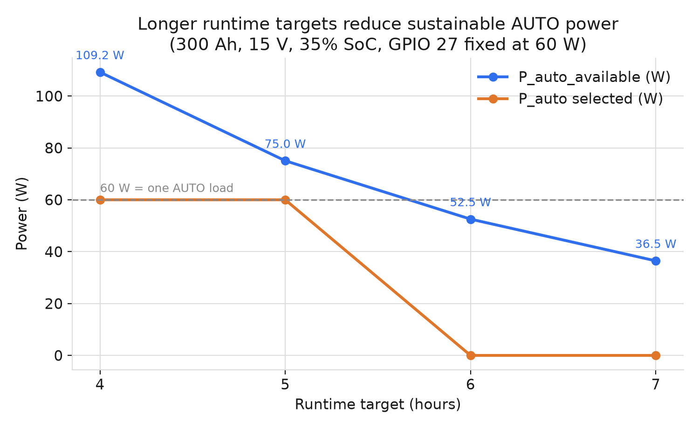
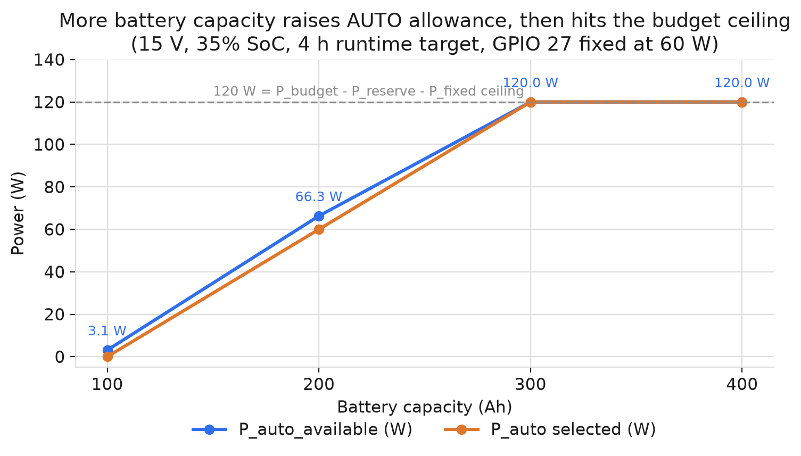
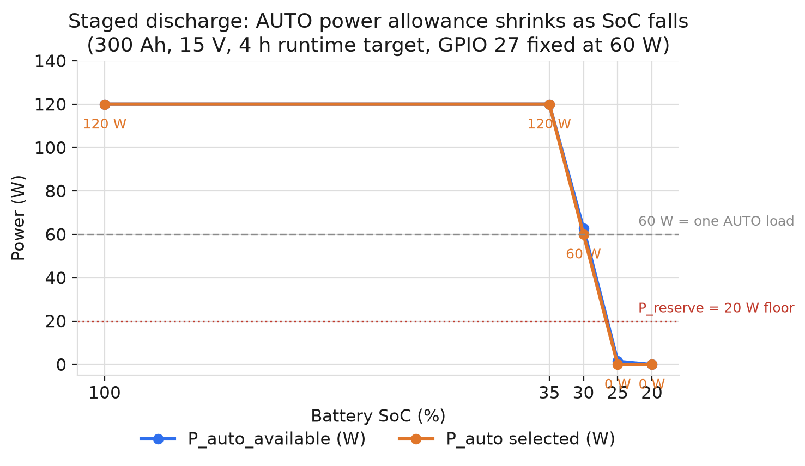

# Kilowatts Demo Script — Console + MQTT Walkthrough

A recording script: every command in order, with a line to say before each
one. Scope is deliberately console + MQTT only — this is everything already
tested and physically verified on real hardware this session. The mobile app
is left out on purpose; it has not been run live against the board yet.

Each step has:
- **Say:** what to tell the camera/panel before running the command.
- **Do:** the exact command(s), copy-paste ready.
- **Expect:** what should appear, so you know the take worked before moving on.

Values below (300 Ah, 15 V, GPIOs 4/5/25/27 at 60 W) match what was actually
run and recorded in
[FOUR_LED_HARDWARE_TEST_2026-08-31.md](FOUR_LED_HARDWARE_TEST_2026-08-31.md) —
adjust only if your board is configured differently. Command names below
(`status`, `battery`, `sensor`, `nodes`, `loads`, `load`, `optimize`, `wifi`,
`mqtt`) are verified against the actual command table in
`lib/CentralConsole/CentralConsole.cpp`, not guessed.

---

## 0. Before you press record

- [ ] Board flashed, powered, serial adapter connected; confirm the port
      (`ls /dev/ttyUSB*` or check PlatformIO) and that nothing else has it
      open (`lsof /dev/ttyUSB*` should show nothing before you start).
- [ ] Wi-Fi credentials on the board match the network you'll actually be
      recording on — if you're at a different location than last time, this
      is the #1 thing that silently breaks the MQTT half.
- [ ] Decide your starting state: for this script to make sense as written,
      the board should be freshly flashed / factory-reset, so "everything is
      zero" is actually true when you record Act 1. If you're reusing an
      already-configured board instead, say so on camera and skip to Act 5.
- [ ] Have a second terminal ready for the MQTT half (Act 11), with the
      broker password available but never typed on camera / not visible in
      the recording.
- [ ] Know which physical LED is wired to which GPIO (4, 5, 25, 27) so you
      can point the camera at the right one when narrating a state change.

---

## Act 1 — Roles (no commands, just narration)

**Say:** "The system has two user roles. The installer's job is narrow: they
commission a node, assign it to a homeowner, and hand over MQTT broker
access. Everything else — battery configuration, load setup, simulation,
day-to-day control — is the homeowner's job, done either from this console
during setup, or from the mobile app afterward."

---

## Act 2 — Fresh boot: confirm the blank slate

**Say:** "Right after flashing, before touching anything, let's confirm the
board is genuinely starting from zero — no network, no battery configured,
nothing added."

**Do:**
```
status
```

**Expect:** Wi-Fi and MQTT reported disconnected, nothing configured yet.

**Do:**
```
battery
loads
```

**Expect:** `battery` reports no battery setup and the INA219 sensor not
detected (nothing is wired yet); `loads` reports zero loads. This is the
"before installation" baseline the rest of the demo builds from.

---

## Act 3 — Installer: Wi-Fi and broker access

**Say:** "The first real step is getting the board on the network and
pointing it at the broker, so it can expose its information and be managed
remotely afterward. This is console-only by design — it never happens over
MQTT, for safety."

**Do:**
```
wifi set ssid=<your-network> password=<your-password>
wifi status
mqtt set host=<broker-host> port=8883 tls=on username=<user> password=<password>
mqtt status
```

**Expect:** `wifi status` reports connected with an IP; `mqtt status`
reports connected once the broker accepts the credentials.

---

## Act 4 — Check what nodes exist

**Say:** "Now that we're networked, let's see what nodes the system
currently knows about."

**Do:**
```
nodes
```

**Expect:** only the Central node itself is listed. That's expected — the
project currently has one active ESP32. With a Smart Node board present and
commissioned, it would appear here too, alongside its own loads.

---

## Act 5 — Homeowner: configure the battery

**Say:** "Before adding a single load, the homeowner has to tell the system
what battery it's working with — this is the one thing that can't be
measured or guessed. Capacity in amp-hours, nominal voltage, and a starting
state of charge for coulomb counting to track from."

**Do:**
```
battery setup capacity=300 voltage=15 soc=100
```

**Expect:** `battery setup saved`.

---

## Act 6 — Try the real sensor, then fall back to simulation

**Say:** "Let's actually try the real sensor first, rather than just
assuming it's not there."

**Do:**
```
sensor ina219
```

**Expect:** it fails cleanly — `FAIL: INA219 input could not be selected`,
followed by the exact INA219 status confirming it isn't detected. No
physical sensor is wired yet, so this is the correct, honest result.

**Say:** "Since there's no hardware risk we want to take yet, we run
everything in simulation instead."

**Do:**
```
sensor sim
```

**Expect:** `measurement source: SIMULATION`.

---

## Act 7 — Power plan: budget and reserve

**Say:** "This is the main constraint in the whole system: the budget. It's
a power ceiling — how many watts, combined, everything running right now is
allowed to draw. It is not the battery's total energy; it's a rate limit,
decided by the installer's knowledge of the wiring, not measured by
anything. Reserve is a safety margin held back from that same ceiling —
headroom the automatic loads are never allowed to touch."

**Do:**
```
battery plan budget=200 reserve=20 min_soc=20
```

**Expect:** `power planning configured`.

**Say:** "Order matters here — if I supply the simulated battery reading
before this step, saving the plan reloads a stale, previously-stored charge
level and throws it away. So the simulated values always go *after* the
plan, never before."

**Do:**
```
sensor values voltage=15 current=1 soc=100
optimize
```

**Expect:** the `KILOWATTS DASHBOARD` block prints — note `P_budget`,
`P_reserve`, and `P_auto_available` (should read 180 W: 200 − 20).

### Optional checkpoint: full status recap

Anywhere from here on, running the bare `battery` command (no arguments)
gives a one-shot recap of everything configured so far — useful as a spoken
checkpoint before moving on:

**Do:**
```
battery
```

**Say:** "Let's do a quick full recap with one command. This confirms
everything we've set up so far. INA219 not configured just means no real
sensor is connected — that's intentional, we're using simulation. Battery
setup is done — that's our capacity, voltage, and starting charge from
earlier. Voltage and current here are the values I fed in manually to
represent what the battery is doing. From those two numbers the system
calculates the power being drawn, and separately, it's been continuously
tracking the battery's actual charge level in the background — using
coulomb counting, meaning it's genuinely accumulated that over time, not
just echoing back a number I typed. Below that is our power plan: budget,
reserve, minimum SoC, and the current runtime target."

### Reference: exactly how `P_auto_available` is calculated

Worth having ready if asked "how is that number actually computed" — this is
the literal logic from `PowerManager.cpp`, not a simplification:

```
Step 1 — subtract reserve from budget:
    afterReserve = P_budget − P_reserve

Step 2 — only if a runtime target is configured, compute how much power the
battery can sustain for that many hours:
    usableFraction   = max(0, (SoC − min_soc) / 100)
    usableEnergyWh   = capacityAh × nominalVoltage × usableFraction
    runtimeAllowance = usableEnergyWh / runtimeHours

Step 3 — take whichever of the two is smaller, then subtract the Fixed load:
    P_auto_available = max(0, min(afterReserve, runtimeAllowance) − P_fixed)
```

Worked example, no runtime target (Act 7 above): Budget 200, Reserve 20,
Fixed 0 → `afterReserve = 180`; no runtime target means Step 2 never runs,
so `P_auto_available = 180 − 0 = 180 W` directly — the plain budget figure.

Worked example, with a runtime target (same configuration as Act 10/11
below — 300 Ah, 15 V, 35% SoC, 20% minimum, 4 h runtime, 60 W Fixed):
```
afterReserve     = 200 − 20 = 180
usableFraction   = (35 − 20) / 100 = 0.15
usableEnergyWh   = 300 × 15 × 0.15 = 675 Wh
runtimeAllowance = 675 / 4 = 168.75 W
P_auto_available = min(180, 168.75) − 60 = 108.75 W
```
The recorded live result for this exact case was 109.23 W (row 11 of the
CSV) — a fraction of a watt off this hand-calculation because the live SoC
at the moment `optimize` actually ran had drifted slightly from the exact
35.000% typed in (real elapsed time + the EMA filter settling). The formula
is exact; live readings drift by tenths of a percent, which is expected, not
a discrepancy to worry about on camera.

The point to make on camera: whichever of `afterReserve` and
`runtimeAllowance` is *smaller* wins — sometimes it's the budget, sometimes
it's the battery's energy for your chosen runtime. Say which one is
currently binding by comparing the two numbers, don't assume it's always the
budget.

---

## Act 8 — Adding loads

**Say:** "Now the four loads. Each has a priority — lower number wins when
power is tight — and a power rating the installer measured or looked up on
the appliance nameplate. All four attach to this one Central node for now;
with a Smart Node present, some of these would instead be added against
that node's MAC address, and both would show up under `nodes`."

**Do:**
```
load add pin=4 name=LED_GPIO4 power=60 priority=4 type=DC active_high=off mode=AUTO_OFF schedule=none
load add pin=5 name=LED_GPIO5 power=60 priority=3 type=DC active_high=off mode=AUTO_OFF schedule=none
load add pin=25 name=LED_GPIO25 power=60 priority=2 type=DC active_high=off mode=AUTO_OFF schedule=none
load add pin=27 name=LED_GPIO27 power=60 priority=1 type=DC active_high=off mode=AUTO_OFF schedule=none
optimize
```

**Expect:** dashboard shows `P_auto_available: 180.00 W`, `P_auto: 180.00 W`,
3 of 4 automatic loads selected (three 60 W loads = 180 W exactly). Point
the camera at the physical LEDs: GPIOs 4, 5, 25 should be lit; GPIO 27 (the
lowest priority) should be off.

**Say:** "This is priority in action — three 60-watt loads exactly fill the
180-watt allowance. The fourth, lowest-priority load is the one that gets
shed, and you can see it live on the relay."

---

## Act 9 — Fixed vs Auto, and schedules

**Say:** "Not every load should be automatically managed. GPIO 27 is going
to become a Fixed load instead — always on, regardless of planning, subject
to safety limits."

**Do:**
```
load set pin=27 mode=FIXED_ON schedule=none
load set pin=25 schedule=15:20-15:23
optimize
dashboard
```

*(Replace the schedule time with a window a few minutes from when you're
recording, so you can show it active, then show it expire live.)*

**Expect:** GPIO 27 shows `FIXED_ON`, consuming its 60 W first;
`P_auto_available` drops to 120 W (180 − 60); GPIO 25's schedule gives it a
temporary priority boost while the window is open, so it's selected over
GPIO 4/5 during that time. Wait for the window to close on camera, run
`optimize` again, and show GPIO 25 shed back to its normal priority.

**Say:** "One thing worth being upfront about — `load show` only displays
the schedule's start time, not the full window. That's a known display bug
in the console; the underlying schedule logic itself uses both the start
and end time correctly, which is what you just saw happen."

---

## Act 10 — Runtime target: sustainability over time

**Say:** "Budget alone doesn't know how long the battery can sustain that
rate. That's what a runtime target is for — an optional extra constraint."

**Do (repeat for each runtime value, re-supplying SoC each time):**
```
battery plan budget=200 reserve=20 min_soc=20 runtime=4
sensor values voltage=13 current=9.231 soc=35
optimize
```
Then repeat with `runtime=5`, `runtime=6`, `runtime=7` (same `sensor values`
line each time).

**Expect:** `P_auto_available` steps down as the runtime target lengthens —
109 W at 4h, 75 W at 5h, then drops below the 60 W needed for a load at 6h
and 7h, shedding the last AUTO load. Full numbers in
[four_led_test_results_2026-08-31.csv](four_led_test_results_2026-08-31.csv)
rows 11–14, or the chart:


**Say:** "One gotcha to flag honestly: typing the same runtime value again
doesn't restart its countdown — only *changing* the value does. If I want a
fresh four-hour window, I have to set it to something else first, then back
to four."

---

## Act 11 — Battery capacity: more energy, more headroom (up to a ceiling)

**Say:** "Now holding runtime and SoC fixed, only changing battery
capacity, to show the other side of the same formula."

**Do (repeat for each capacity):**
```
battery setup capacity=100 voltage=15 soc=35
sensor sim
battery plan budget=200 reserve=20 min_soc=20 runtime=4
sensor values voltage=13 current=9.231 soc=35
optimize
```
Then repeat with `capacity=200`, `capacity=300`, `capacity=400`.

**Expect:** allowance rises with capacity — 3 W at 100 Ah, 66 W at 200 Ah,
120 W at 300 Ah — then **300 and 400 Ah give the identical result.** That's
not a bug: past 300 Ah, the runtime-sustainable energy already exceeds the
fixed budget ceiling (`P_budget − P_reserve − P_fixed` = 120 W), so the
budget — not the battery — becomes the limit. See
.

**Say:** "This is the moment to explain that budget and battery energy are
two separate ceilings, and whichever is smaller wins. A bigger battery only
helps up to the point where the *other* ceiling takes over."

---

## Act 12 — Staged discharge: protecting the battery

**Say:** "Last scenario on the console: what happens as the battery
actually depletes, down to the protected minimum."

**Do (repeat for each SoC/current pair):**
```
battery setup capacity=300 voltage=15 soc=100
sensor sim
battery plan budget=200 reserve=20 min_soc=20 runtime=4
sensor values voltage=15 current=12 soc=100
optimize
```
Then in sequence: `voltage=13 current=13.846 soc=35`,
`voltage=12 current=10 soc=30`, `voltage=11.5 current=5.217 soc=25`,
`voltage=11 current=5.455 soc=20`.

**Expect:** AUTO loads shed one by one as SoC falls; at 20% (the configured
minimum), AUTO allowance hits 0 W and the runtime target flips to `NOT
ACHIEVABLE` — but the Fixed load (GPIO 27) stays on throughout, because
Fixed loads aren't subject to this protection the same way. See
.

---

## Act 13 — Same control, over MQTT

**Say:** "Everything so far went through the serial console. Now the exact
same commands, sent remotely over MQTT, to prove it's the same underlying
system, not a separate code path."

**Do (second terminal, subscribe first):**
```
mosquitto_sub -h <broker-host> -p 8883 --capath /etc/ssl/certs \
  -u <user> -P '<password>' -t 'kilowatts/v1/#' -v
```

**Do (publish a command):**
```
mosquitto_pub -h <broker-host> -p 8883 --capath /etc/ssl/certs \
  -u <user> -P '<password>' \
  -t kilowatts/v1/command \
  -m '{"type":"system","commandId":1,"action":"optimize"}'
```

**Expect:** an `ack` message with `status:"APPLIED"` appears in the
subscriber, followed by a fresh `state` broadcast — the same dashboard
numbers you've been reading on the console, now arriving over the network.

**Say:** "The console and MQTT share the exact same command handlers in
firmware — this isn't a demo-only shortcut, it's the same dispatcher a
mobile app would call."

---

## Closing — the one honest caveat

**Say:** "Everything in this demo used simulated voltage, current, and
state of charge — every `P_measured` value you saw was a number I typed in,
not a sensor reading. That's deliberate: it lets us prove the planner,
scheduler, priority logic, and both control paths are correct before
connecting a real INA219. Real sensor measurement is the explicitly scoped
next phase, not yet done — and no conclusion in this demo should be read as
validating sensor accuracy or calibration."
