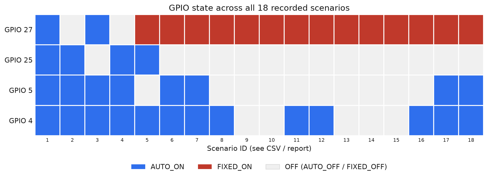

# Four-LED Hardware and Simulation Test Report

**Test date:** 2026-08-31  
**Timezone:** Africa/Lusaka  
**Project:** Kilowatts  
**Central Node MAC:** `A4:CF:12:0E:32:C0`  
**Serial adapter:** CP2102 USB-to-UART (`VID:PID 10C4:EA60`, serial `0001`)  

## Purpose

This is a new physical-load test using four LED loads connected through relay
channels controlled by Central Node GPIO pins 4, 5, 25, and 27. It is separate
from the earlier eight-load QA configuration.

The test begins with direct fixed-state relay checks and then moves to automatic
load allocation using simulated battery inputs. Physical LED observations are
recorded separately from firmware-reported GPIO state.

## Fresh four-load configuration

The previous eight-load QA configuration was removed from the board. A new
configuration containing only the four connected LED channels was created.

| GPIO | Load name | Configured rating | Priority | Type | Polarity |
|---:|---|---:|---:|---|---|
| 4 | `LED_GPIO4` | 1.00 W | 4 | DC | active-LOW |
| 5 | `LED_GPIO5` | 1.00 W | 3 | DC | active-LOW |
| 25 | `LED_GPIO25` | 1.00 W | 2 | DC | active-LOW |
| 27 | `LED_GPIO27` | 1.00 W | 1 | DC | active-LOW |

The 1 W values are planner test ratings. They are not measured consumption.

The clean baseline placed all four loads in `FIXED_OFF`. The dashboard then
reported:

| Statistic | Result |
|---|---:|
| `P_fixed` | 0.00 W |
| `P_auto_available` | 180.00 W |
| `P_auto` | 0.00 W |
| `P_remaining` | 200.00 W |
| Fixed ON / OFF | 0 / 4 |
| Automatic loads | 0 / 0 |

At that time no measurement source was selected, so measured power and battery
SoC were unavailable.

## GPIO 4 relay and load test

### Initial wiring result

GPIO 4 was changed from `FIXED_OFF` to `FIXED_ON`. The firmware reported
`applied`, and `load show 4` reported:

- mode `FIXED_ON`;
- relay polarity active-LOW;
- relay hardware applied `yes`.

The physical relay indicator was ON, but the physical load LED was OFF.

GPIO 4 was then changed to `FIXED_OFF`. The firmware again reported `applied`.
The physical relay indicator turned OFF and the physical load LED turned ON.

This proved that the load was connected through the relay's normally-closed
path (`COM + NC`). The physical state was therefore inverted relative to the
firmware's logical state.

### Wiring correction

The load connection was moved from `COM + NC` to `COM + NO`.

After the change, GPIO 4 was commanded `FIXED_ON`. The user confirmed that the
relay indicator was ON and the physical load LED was ON. This confirms correct
logical-ON behavior through the normally-open contact.

GPIO 4 was later commanded `FIXED_OFF`, and the firmware reported `applied`.
The firmware state was verified as:

- mode `FIXED_OFF`;
- active-LOW polarity;
- relay hardware applied `yes`.

The on-site user later confirmed that the relay and connected load followed the
commanded states on the physical hardware. GPIO 4 therefore passed both the ON
and OFF checks after the move to `COM + NO`.

## Serial connection observation

During the GPIO 4 OFF command, the serial monitor reported an input/output
error. The CP2102 adapter remained visible over USB, but the Linux serial-device
name changed from `/dev/ttyUSB0` to `/dev/ttyUSB1`.

The monitor was reconnected on `/dev/ttyUSB1`. The console prompt returned, and
the GPIO 4 configuration remained persisted. No firmware configuration was lost.

## Simulation configuration

The following battery and planning values were configured:

| Input | Value |
|---|---:|
| Battery capacity | 300 Ah |
| Nominal voltage | 15 V |
| Starting SoC | 100% |
| Power budget | 200 W |
| Power reserve | 20 W |
| Minimum SoC | 20% |
| Initial runtime target | 4 hours |
| Simulated voltage | 15 V |
| Simulated current | 1 A discharge |
| Simulated power | 15 W |

All four loads were changed from fixed control to `AUTO_OFF`, after which an
explicit optimization cycle was run.

## Simulation setup-order finding

The first attempt applied simulated SoC 100% before saving the runtime plan.
Saving the runtime plan reloaded a previously persisted SoC of 70%. The
dashboard consequently showed 70%, which was not a valid result for the new
test input.

The working command order was:

```text
battery setup capacity=300 voltage=15 soc=100
sensor sim
battery plan budget=200 reserve=20 min_soc=20 runtime=4
sensor values voltage=15 current=1 soc=100
optimize
```

Reapplying the simulated values after the power plan restored the requested
100% SoC. Future simulation cases must apply their simulated SoC after any
change to the battery plan.

## Four-hour simulation result

The corrected four-hour baseline produced:

| Statistic | Result |
|---|---:|
| Measurement source | SIMULATED |
| Voltage | 15.00 V |
| Current | 1.00 A |
| `P_measured` | 15.00 W |
| Battery SoC | 100.0% |
| `P_budget` | 200.00 W |
| `P_reserve` | 20.00 W |
| `P_fixed` | 0.00 W |
| `P_auto_available` | 180.00 W |
| `P_auto` | 4.00 W |
| `P_remaining` | 196.00 W |
| Runtime | approximately 3.98 hours remaining, achievable |
| Automatic loads selected | 4 / 4 |

The firmware reported all four channels as `AUTO_ON`:

| GPIO | Firmware state |
|---:|---|
| 4 | `AUTO_ON` |
| 5 | `AUTO_ON` |
| 25 | `AUTO_ON` |
| 27 | `AUTO_ON` |

The on-site user confirmed that the automatic commands were occurring on the
physical relay hardware and connected LED loads.

## Measurement boundary

The reported 15 W is calculated from the manually supplied simulation values:
15 V x 1 A. It is not a measurement of the four physical LEDs. The firmware
cannot report real physical load power until an INA219 is correctly installed
in the physical load-supply path and hardware measurement mode is selected.

## 60 W per-load allocation test

All four planner ratings were changed from 1 W to 60 W. The console does not
support changing a Load's power rating with `load set`, so each entry was
removed and re-added with its existing identity, priority, DC type, active-LOW
polarity, and no schedule. Each Load was added in `AUTO_OFF` before the explicit
optimization cycle.

The resulting configuration and decision were:

| GPIO | Rating | Priority | Schedule | Optimized state |
|---:|---:|---:|---|---|
| 4 | 60 W | 4 | none | `AUTO_ON` |
| 5 | 60 W | 3 | none | `AUTO_ON` |
| 25 | 60 W | 2 | none | `AUTO_ON` |
| 27 | 60 W | 1 | none | `AUTO_OFF` |

The dashboard reported:

| Statistic | Result |
|---|---:|
| Battery SoC | 100.0% |
| `P_budget` | 200.00 W |
| `P_reserve` | 20.00 W |
| `P_auto_available` | 180.00 W |
| `P_auto` | 180.00 W |
| `P_remaining` | 20.00 W |
| Runtime | approximately 3.87 hours remaining, achievable |
| Automatic loads selected | 3 / 4 |

This is the expected priority result. The 180 W automatic allowance fits
exactly three 60 W Loads, so pins 4, 5, and 25 were selected. Pin 27 had the
lowest priority and was rejected.

## GPIO 27 active-schedule test

No Load was removed for this test. GPIO 27 was updated in place with:

```text
load set A4:CF:12:0E:32:C0 27 schedule=15:00-15:16
```

The command reported `applied`. Optimization was then run while the configured
window was active.

### Battery, measurement, and planning attributes

| Attribute | Value |
|---|---:|
| Measurement source | SIMULATED |
| Battery capacity | 300 Ah |
| Nominal voltage | 15 V |
| Simulated voltage | 15.00 V |
| Simulated current | 1.00 A discharge |
| Simulated measured power | 15.00 W |
| Battery SoC at result | 99.9% |
| Minimum SoC | 20% |
| Runtime target | 4 hours |
| Runtime remaining at result | approximately 3.81 hours |
| Runtime target status | achievable |
| `P_budget` | 200.00 W |
| `P_reserve` | 20.00 W |
| `P_fixed` | 0.00 W |
| `P_auto_available` | 180.00 W |
| `P_auto` | 180.00 W |
| `P_remaining` | 20.00 W |

### Load decision

| GPIO | Rating | Base priority | Schedule | Optimized state |
|---:|---:|---:|---|---|
| 4 | 60 W | 4 | none | `AUTO_ON` |
| 5 | 60 W | 3 | none | `AUTO_ON` |
| 25 | 60 W | 2 | none | `AUTO_OFF` |
| 27 | 60 W | 1 | 15:00-15:16 | `AUTO_ON` |

The active schedule added the firmware's +5 priority boost to GPIO 27. Its
effective priority became 6, causing it to replace GPIO 25 in the three-Load,
180 W selection. The on-site user confirmed that these state changes occurred
on the physical relay hardware and connected loads.

### Schedule display finding

`load show 27` displayed `AUTO schedule : 15:00` rather than the complete
`15:00-15:16` window. Code inspection confirmed that the status formatter
prints only `startHour` and `startMinute`; the schedule parser and evaluator
store and use both the start and end values. This is a console display defect,
not evidence that the end time was discarded.

### After-window observation

The live board was queried at **2026-08-31 15:18:02 CAT (UTC+02:00)**, after
the scheduled end time of 15:16. The periodic optimizer had removed GPIO 27's
schedule boost and restored the normal base-priority selection.

Battery, measurement, and planning attributes at the observation were:

| Attribute | Value |
|---|---:|
| Measurement source | SIMULATED |
| Battery capacity | 300 Ah |
| Nominal voltage | 15 V |
| Simulated voltage | 15.00 V |
| Simulated current | 1.00 A discharge |
| Simulated measured power | 15.00 W |
| Battery SoC | 99.9% |
| Minimum SoC | 20% |
| Runtime target | 4 hours |
| Runtime remaining | approximately 3.78 hours |
| Runtime target status | achievable |
| `P_budget` | 200.00 W |
| `P_reserve` | 20.00 W |
| `P_fixed` | 0.00 W |
| `P_auto_available` | 180.00 W |
| `P_auto` | 180.00 W |
| `P_remaining` | 20.00 W |

The live firmware states were:

| GPIO | Base priority | State after 15:16 |
|---:|---:|---|
| 4 | 4 | `AUTO_ON` |
| 5 | 3 | `AUTO_ON` |
| 25 | 2 | `AUTO_ON` |
| 27 | 1 | `AUTO_OFF` |

This confirms that the schedule boost ended correctly at 15:16. GPIO 27 was
automatically shed, and GPIO 25 was automatically restored. This is a
firmware/console-state confirmation backed by the on-site user's physical
observation that GPIO 27's relay/load channel was OFF after the window ended.

## GPIO 27 fixed and GPIO 25 scheduled

No Load was removed. GPIO 27 was changed in place to `FIXED_ON`, and its old
schedule was cleared. GPIO 25 was given an active schedule from 15:20 to 15:23:

```text
load set A4:CF:12:0E:32:C0 27 mode=FIXED_ON schedule=none
load set A4:CF:12:0E:32:C0 25 schedule=15:20-15:23
optimize
```

The result was captured at **2026-08-31 15:22:50 CAT (UTC+02:00)** while the
GPIO 25 window was active.

### Battery, measurement, and planning attributes

| Attribute | Value |
|---|---:|
| Measurement source | SIMULATED |
| Battery capacity | 300 Ah |
| Nominal voltage | 15 V |
| Simulated voltage | 15.00 V |
| Simulated current | 1.00 A discharge |
| Simulated measured power | 15.00 W |
| Battery SoC | 99.9% |
| Minimum SoC | 20% |
| Runtime target | 4 hours |
| Runtime remaining | approximately 3.70 hours |
| Runtime target status | achievable |
| `P_budget` | 200.00 W |
| `P_reserve` | 20.00 W |
| `P_fixed` | 60.00 W |
| `P_auto_available` | 120.00 W |
| `P_auto` | 120.00 W |
| `P_remaining` | 20.00 W |

### Load decision during the GPIO 25 window

| GPIO | Rating | Base priority | Control/schedule | State |
|---:|---:|---:|---|---|
| 4 | 60 W | 4 | AUTO, none | `AUTO_ON` |
| 5 | 60 W | 3 | AUTO, none | `AUTO_OFF` |
| 25 | 60 W | 2 | AUTO, 15:20-15:23 | `AUTO_ON` |
| 27 | 60 W | 1 | FIXED | `FIXED_ON` |

GPIO 27 consumed 60 W of fixed allocation first. This left 120 W for two AUTO
Loads. GPIO 25's active schedule raised its effective priority from 2 to 7, so
the planner selected GPIO 25 and GPIO 4 and shed GPIO 5.

## Staged battery-discharge simulation

The discharge test retained the same 300 Ah battery profile, 200 W budget,
20 W power reserve, 20% minimum SoC, and four-hour runtime target. GPIO 27
remained `FIXED_ON`; GPIOs 4, 5, and 25 remained 60 W AUTO Loads. The GPIO 25
schedule had ended before the discharge selection results below, so normal base
priorities applied.

Voltage, current, and SoC were supplied manually through `sensor values` at
each level. Current was chosen to approximate the total configured power of the
expected selected Loads. The optimizer does not generate simulated current
from relay state; simulation remains an explicit sensor-input path.

### Measured results

| SoC input | V/A input | Filtered V/A reported | `P_measured` | `P_auto_available` | `P_auto` | `P_remaining` | Runtime status | Selected states |
|---:|---|---|---:|---:|---:|---:|---|---|
| 100% | 15 V / 12 A | 15.00 V / 11.75 A | 176.28 W | 120.00 W | 120.00 W | 20.00 W | 3.68 h, achievable | 4 ON, 5 ON, 25 OFF, 27 FIXED_ON |
| 35% | 13 V / 13.846 A | 13.03 V / 13.82 A | 180.05 W | 120.00 W | 120.00 W | 20.00 W | 3.67 h, achievable | 4 ON, 5 ON, 25 OFF, 27 FIXED_ON |
| 30% | 12 V / 10 A | 12.03 V / 10.11 A | 121.58 W | 62.70 W | 60.00 W | 80.00 W | 3.66 h, achievable | 4 ON, 5 OFF, 25 OFF, 27 FIXED_ON |
| 25% | 11.5 V / 5.217 A | 11.52 V / 5.43 A | 62.54 W | 1.48 W | 0.00 W | 140.00 W | 3.65 h, achievable | 4 OFF, 5 OFF, 25 OFF, 27 FIXED_ON |
| 20% | 11 V / 5.455 A | 11.03 V / 5.44 A | 60.01 W | 0.00 W | 0.00 W | 140.00 W | 3.65 h, not achievable | 4 OFF, 5 OFF, 25 OFF, 27 FIXED_ON |

Every row retained `P_fixed = 60.00 W`. The measured power in each row is the
firmware result of filtered voltage multiplied by filtered current. Small
differences from the direct input product are caused by the configured
exponential moving-average filter settling after each input change.

### Findings

1. At 100% and 35% SoC, the normal 180 W installation allowance was binding:
   60 W fixed plus two 60 W AUTO Loads were selected.
2. At 30% SoC, runtime sustainability reduced AUTO allowance to 62.70 W, so
   only the highest-priority 60 W AUTO Load on GPIO 4 remained ON.
3. At 25% SoC, only 1.48 W remained for AUTO allocation. No 60 W AUTO Load fit,
   but the fixed GPIO 27 Load remained ON and the runtime target was still
   reported achievable.
4. At the configured 20% minimum SoC, AUTO allowance became 0 W. GPIO 27 stayed
   `FIXED_ON`, and the four-hour runtime target changed to `NOT ACHIEVABLE`.
5. This confirms the documented policy that runtime and reserve constraints
   shed AUTO Loads but do not override a `FIXED_ON` Load.

The final live test state at **2026-08-31 15:26:08 CAT (UTC+02:00)** was the
20% row: GPIOs 4, 5, and 25 `AUTO_OFF`, with GPIO 27 `FIXED_ON`.

## Four-, five-, six-, and seven-hour runtime comparison

The earlier discharge series used only one configured runtime target of four
hours; its displayed remaining time decreased as real wall-clock time passed.
It was not a comparison of different runtime targets. A controlled runtime
comparison was therefore run afterward.

Every comparison case used the same core inputs:

| Attribute | Value |
|---|---:|
| Measurement source | SIMULATED |
| Battery capacity | 300 Ah |
| Nominal voltage | 15 V |
| Simulated SoC | 35% |
| Minimum SoC | 20% |
| `P_budget` | 200 W |
| `P_reserve` | 20 W |
| `P_fixed` | 60 W on GPIO 27 |
| AUTO candidates | GPIOs 4, 5, and 25 at 60 W each |
| Active schedules | none; GPIO 25's window had ended |

The runtime target was changed between cases. Simulated current was adjusted to
approximately match the configured power of the selected fixed and AUTO Loads.

| Runtime target | Reported remaining | V/A input | Filtered V/A reported | `P_measured` | `P_auto_available` | `P_auto` | `P_remaining` | Runtime status | Selected states |
|---:|---:|---|---|---:|---:|---:|---:|---|---|
| 4 h | 3.99 h | 13 V / 9.231 A | 13.00 V / 9.36 A | 121.69 W | 109.23 W | 60 W | 80 W | achievable | 4 ON, 5 OFF, 25 OFF, 27 FIXED_ON |
| 5 h | 4.99 h | 13 V / 9.231 A | 13.00 V / 9.33 A | 121.35 W | 75.05 W | 60 W | 80 W | achievable | 4 ON, 5 OFF, 25 OFF, 27 FIXED_ON |
| 6 h | 5.99 h | 13 V / 4.615 A | 13.00 V / 4.82 A | 62.63 W | 52.55 W | 0 W | 140 W | achievable | 4 OFF, 5 OFF, 25 OFF, 27 FIXED_ON |
| 7 h | 7.00 h | 13 V / 4.615 A | 13.00 V / 4.61 A | 60.00 W | 36.46 W | 0 W | 140 W | achievable | 4 OFF, 5 OFF, 25 OFF, 27 FIXED_ON |

The result follows the runtime-energy formula. At 35% SoC with a 20% minimum,
the 300 Ah, 15 V battery has 675 Wh of usable energy. Dividing that energy over
a longer requested runtime reduces sustainable power. The fixed 60 W Load is
then subtracted before AUTO allocation:

- four hours left about 109 W for AUTO, allowing one 60 W AUTO Load;
- five hours left about 75 W for AUTO, also allowing one;
- six hours left about 52.5 W, allowing none;
- seven hours left about 36.5 W, allowing none.

All four targets remained achievable because the sustainable total allowance
was still at least the 60 W required by fixed GPIO 27.

### Real-time runtime behavior

The runtime target is expressed in real hours. With valid Central time, the
firmware stores an in-memory reference time and subtracts real elapsed time on
each optimization cycle. This was directly observed when the original
four-hour target fell from approximately 3.70 to 3.65 hours during testing.

Re-saving the same four-hour value did not restart its countdown; it continued
at 3.58 hours. Code inspection confirmed that the in-memory reference resets
only when the configured runtime-hour value changes. Changing to five, six,
seven, and then back to four hours reset each case and allowed a fair
comparison. This behavior should be treated as an operational limitation if an
installer expects entering the same runtime value to start a new deadline.

The final live state at **2026-08-31 15:33:36 CAT (UTC+02:00)** was the clean
four-hour comparison case: 35% SoC, GPIO 27 `FIXED_ON`, GPIO 4 `AUTO_ON`, and
GPIOs 5 and 25 `AUTO_OFF`.

## Remaining test cases

Further endurance or hardware-sensor cases must record:

1. runtime target, voltage, current, and SoC input;
2. calculated automatic power allowance;
3. selected and rejected loads;
4. firmware state for all four GPIOs;
5. physical state of all four relay indicators and load LEDs.

The current planner ratings are 60 W each, for a combined demand of 240 W.
Without a tighter runtime constraint, the normal budget/reserve calculation
provides 180 W before fixed demand. Runtime/SoC cases can demonstrate staged
load shedding as the available automatic power crosses the 120 W and 60 W
selection thresholds.

## Battery-capacity comparison (100 / 200 / 300 / 400 Ah)

This case was proposed before the CSV/chart/MQTT work below, then deferred
when the next request redirected to CSV/charts/MQTT first. It was run
afterward, driving the serial console programmatically (see the MQTT section
below for why the console — not MQTT — is the only interface that can change
battery capacity).

Fixed inputs for all four cases: 15 V nominal, 35% SoC, `P_budget` 200 W,
`P_reserve` 20 W, minimum SoC 20%, 4-hour runtime target, simulated 13 V /
9.231 A input, GPIO 27 already `FIXED_ON` at 60 W, GPIOs 4/5/25 available as
60 W AUTO candidates with no active schedule. Only `battery capacity` changed
between cases.

| Capacity | `P_auto_available` | `P_auto` | `P_remaining` | Runtime remaining | Selected states |
|---:|---:|---:|---:|---:|---|
| 100 Ah | 3.10 W | 0.00 W | 140.00 W | 3.56 h, achievable | 4 OFF, 5 OFF, 25 OFF, 27 FIXED_ON |
| 200 Ah | 66.31 W | 60.00 W | 80.00 W | 3.56 h, achievable | 4 ON, 5 OFF, 25 OFF, 27 FIXED_ON |
| 300 Ah | 120.00 W | 120.00 W | 20.00 W | 3.56 h, achievable | 4 ON, 5 ON, 25 OFF, 27 FIXED_ON |
| 400 Ah | 120.00 W | 120.00 W | 20.00 W | 3.55 h, achievable | 4 ON, 5 ON, 25 OFF, 27 FIXED_ON |


### Findings

1. Between 100 and 300 Ah, more stored energy directly raises
   `P_auto_available` and lets progressively more 60 W AUTO loads fit — this
   is the runtime-sustainability formula from the earlier runtime comparison,
   run in the other direction (more energy at a fixed runtime, instead of a
   fixed energy at a longer runtime).
2. At 300 Ah, `P_auto_available` reaches exactly 120 W —
   `P_budget − P_reserve − P_fixed` (200 − 20 − 60) — which is the fixed
   installation ceiling, independent of the battery. 400 Ah produces the
   *identical* 120 W and the identical load selection: once the
   runtime-sustainable allowance exceeds this ceiling, the ceiling — not the
   battery — is the binding constraint, so adding more capacity buys nothing
   further at this runtime/SoC. This is the expected behavior of the
   `min(runtime-sustainable power, budget-based ceiling)` design, not a
   plateau bug.
3. Every row's `P_remaining` follows the same
   `P_budget − P_fixed − P_auto` identity already confirmed for every other
   scenario in this report (e.g. 100 Ah: 200 − 60 − 0 = 140).

### Physical confirmation

The on-site user monitored the physical relays/LEDs live while this series
ran and confirmed the following transitions matched the firmware-reported
states exactly:

| Step | Firmware-predicted change | Physical observation |
|---|---|---|
| 100 Ah | GPIO 4's LED turns OFF (was ON from the prior test); 5/25/27 unchanged | Confirmed |
| 200 Ah | GPIO 4's LED turns back ON | Confirmed |
| 300 Ah | GPIO 5's LED also turns ON (GPIO 4 stays ON) | Confirmed |
| 400 Ah | No change — 4 and 5 stay ON | Confirmed |

The user additionally confirmed the board's final live state directly: GPIO 4,
5, and 27 loads physically ON, GPIO 25 off — matching the firmware's reported
400 Ah end state exactly.

The board's live state after this series (400 Ah, 35% SoC, GPIO 4 and 5
`AUTO_ON`, GPIO 25 `AUTO_OFF`, GPIO 27 `FIXED_ON`) was left in place rather
than reset back to 300 Ah.

## CSV export of all recorded scenarios

All 18 quantitative scenarios recorded above — the original 14 plus the four
capacity-comparison cases — were compiled into a single CSV for spreadsheet
analysis:
[four_led_test_results_2026-08-31.csv](four_led_test_results_2026-08-31.csv).

Each row cites the report section it came from. A cell is written `NR` (not
recorded) where the source narrative above did not restate a value for that
step, rather than inferring or guessing it — for example, voltage/current were
not re-stated in the "60 W per-load allocation test" section, so those cells
are `NR` rather than assumed carried over from the previous 15 V / 1 A input.
`input_V`/`input_A` are the manually supplied simulated sensor values;
`filtered_V`/`filtered_A`/`P_measured_W` are the firmware's own reported
values after its exponential moving-average filter, where the source text
gave them separately.

## Charts generated from the CSV

Four charts were rendered from the CSV (`test-evidence/charts/`):

### Staged discharge: AUTO allowance vs SoC


`P_auto_available` and the AUTO power actually selected collapse together at
the 60 W and 0 W thresholds identified in the Findings above: the 300 Ah/15 V
battery at a 4-hour target holds one 60 W AUTO load through 35% SoC, sheds it
between 35% and 30% SoC, and reaches 0 W of AUTO allowance at the 20% minimum
— all while the `FIXED_ON` 60 W GPIO 27 load is unaffected.

### Runtime target vs sustainable AUTO power


At a fixed 35% SoC, `P_auto_available` falls roughly linearly as the
requested runtime target lengthens (energy ÷ more hours = less sustainable
power). The one-AUTO-load selection holds through 5 hours and disappears at 6
and 7 hours, matching the runtime-comparison table above.

### Battery capacity vs sustainable AUTO power


`P_auto_available` rises with capacity from 100 to 300 Ah, then flattens
exactly at 120 W for 300 and 400 Ah — the point where the runtime-sustainable
allowance exceeds the fixed `P_budget − P_reserve − P_fixed` ceiling and that
ceiling, not the battery, becomes the binding constraint.

### GPIO state across all 18 scenarios



This timeline makes two firmware behaviors visible at a glance: GPIO 27
switches from priority-based `AUTO_ON`/`AUTO_OFF` cycling (scenarios 1–4) to a
permanent `FIXED_ON` band (scenarios 5–18) the moment it is fixed; and GPIOs
4/5/25 shed/restore strictly in ascending priority order as SoC, runtime
target, and battery capacity change, never out of order.

Regeneration script: [make_charts.py](make_charts.py) (requires `pandas` and
`matplotlib`; re-run after editing the CSV to refresh all four PNGs).

## MQTT control-path test — completed

The remaining ask was to prove the same control path over MQTT, not just the
serial console, before requesting approval to wire up the INA219. This has now
been run against the live broker.

- MQTT lives in `lib/MqttManager` (`MqttManager.cpp/.h`,
  `MqttCredentialsStore.cpp/.h`), wired into
  `src/central/CentralApplication.cpp` (handler binding) and
  `src/central/namespace.h` (auto-connect once Wi-Fi is up). `main.cpp` itself
  does not touch MQTT directly.
- Every command handler bound to MQTT (`handleLoadCommand`,
  `handleSystemCommand`, `handleConfigCommand`, `handleSimulationCommand`,
  `consoleConfigurePowerPlanningValidated`) is the **same function** bound to
  the serial console's `CentralConsole::Callbacks`. MQTT and the console only
  differ in how the command is parsed (JSON vs text) — they share one
  business-logic dispatcher. This is why an MQTT test exercises the same
  planner/scheduler/priority logic already proven above through a second,
  independent transport, rather than new logic.
- Topics (namespace `kilowatts/v1`, device `central-01`):
  `kilowatts/v1/command` (subscribe — the only inbound topic),
  `kilowatts/v1/ack`, `kilowatts/v1/state`, `kilowatts/v1/status`,
  `kilowatts/v1/alert` (all published). Full JSON command formats are
  documented in `lib/MqttManager/README.md`.
- The MQTT README explicitly places `battery setup` (capacity/voltage/
  starting SoC) in the serial-console-only "installation" boundary — it is
  **not** a frontend MQTT command, which is why the capacity-comparison test
  above had to run over the serial console rather than MQTT.
- The broker was already provisioned on this board: HiveMQ Cloud,
  `f3937cb6e5ab4814a9e88fe931c628af.s1.eu.hivemq.cloud`, TLS port 8883,
  username `kilowatts` (per `test-evidence/capture-real-console.sh`,
  `credentials` case). The password is intentionally not written in this
  report; it is not stored anywhere in the repository
  (`include/KilowattsSecrets.h` is git-ignored and does not exist on this
  machine) and was supplied verbally by the installer to run this test.

### Test 1 — read-only connectivity check

```
mosquitto_sub -h f3937cb6e5ab4814a9e88fe931c628af.s1.eu.hivemq.cloud -p 8883 \
  --capath /etc/ssl/certs -u kilowatts -P '<broker password>' \
  -t 'kilowatts/v1/status' -t 'kilowatts/v1/state' -C 2 -v
```

Result: authenticated successfully and immediately received the retained
messages:

- `kilowatts/v1/status` → `online`
- `kilowatts/v1/state` → a full, current `system`/`loads`/`nodes` snapshot
  matching the board's actual configuration at that moment (300 Ah, GPIO 27
  `FIXED_ON`, GPIO 4 `AUTO_ON`, GPIOs 5/25 `AUTO_OFF` with GPIO 25's
  15:20–15:23 schedule still attached, `stateOfChargePercent: 34.088` from
  ongoing coulomb counting, `remainingRuntimeHours: 3.694`,
  `resetReason: "WDT"` on the Central node diagnostics).

This alone proves the telemetry side of MQTT: the retained `state`/`status`
topics reflect real, live firmware state, not a cached or stale value.

### Test 2 — round-trip command control

Published:

```
mosquitto_pub -h f3937cb6e5ab4814a9e88fe931c628af.s1.eu.hivemq.cloud -p 8883 \
  --capath /etc/ssl/certs -u kilowatts -P '<broker password>' \
  -t kilowatts/v1/command \
  -m '{"type":"system","commandId":9001,"action":"optimize"}'
```

Received on `kilowatts/v1/ack`:

```json
{"schemaVersion":5,"commandId":9001,"commandType":"system","status":"APPLIED","reason":"optimization requested","target":null}
```

This confirms the full round trip: a command published from an external MQTT
client reached the Central node, was dispatched through the same handler the
serial console uses, executed, and returned a correctly-correlated
(`commandId` match) `APPLIED` acknowledgement.

### What this does and does not prove

- **Proven:** MQTT telemetry (`status`/`state`) is live and accurate to
  firmware state; MQTT command control (`command`/`ack`) reaches the same
  planner dispatcher as the serial console and is correctly acknowledged. The
  on-site user was monitoring the physical hardware throughout this test and
  observed no unexpected LED/relay change, consistent with the `optimize`
  command not altering any input — the board's physical state stayed exactly
  where the firmware said it was.
- **Not run this pass:** a load-mode command specifically chosen to force a
  physically visible transition (e.g. toggling GPIO 25) over MQTT. The
  capacity-comparison series afterward (over the serial console, physically
  confirmed above) already exercises that same relay code path with visible
  transitions, so this is a minor completeness gap rather than an open
  question about MQTT correctness.

## Honest status ahead of INA219 approval

Combining every result above:

- **Proven on real hardware, over both control paths:** relay polarity/
  wiring, Fixed vs Auto mode switching, priority-based Auto selection and
  shedding, schedule-window priority boosts and expiry, runtime-target
  sustainability shedding, SoC-driven staged shedding down to the configured
  minimum, and capacity-driven allowance scaling up to the budget ceiling —
  every case in this report, including the capacity-comparison and MQTT
  series, was cross-checked against physical LED/relay state by the on-site
  user, not just firmware self-reports.
- **Proven for MQTT specifically:** live telemetry and round-trip command
  control reach the identical planner logic already validated over the serial
  console.
- **Still unverified:** real voltage/current/power measurement accuracy. Every
  `P_measured` value in this report, the CSV, and the charts is a **manually
  supplied simulated input**, not a sensor reading. No conclusion above should
  be read as validating INA219 measurement, calibration, or wiring — that
  remains the explicit purpose of the next phase, and no INA219 mode or wiring
  should be changed before that phase is approved.
